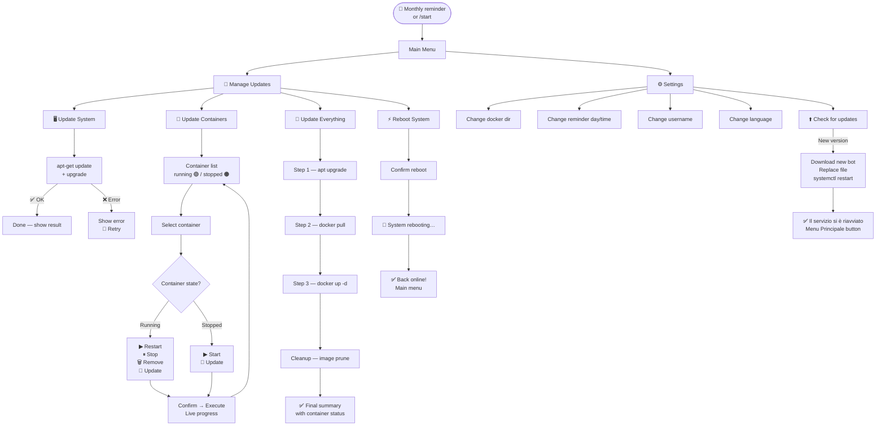

<div align="center">


# Stack Updater

**Manage your Linux server and Docker containers from anywhere, directly from Telegram.**

</div>

---

## Why I built this

I manage a Raspberry Pi at home running several Docker containers — Home Assistant, monitoring tools, and other self-hosted services. Every time I needed to apply system updates or pull new container images, I had to SSH into the machine, run the commands manually, and wait to see if everything came back up correctly.

That was fine when I was at home. But when I was out, it was either too risky to do it blind or too inconvenient to open a terminal from my phone.

So I built **Stack Updater** — a Telegram bot that runs as a systemd service on the server and lets me update the system and manage every Docker container with a few button taps, from anywhere in the world, with real-time feedback at every step.

---

## What it does

- 🖥️ **System updates** — runs `apt-get update && apt-get upgrade` and reports the result
- 🐳 **Container management** — lists all containers (running and stopped), lets you start, restart, stop, remove or update any single one
- 🔄 **Full update** — system + all containers in a single operation, with automatic image cleanup (`docker image prune`)
- ⚡ **Remote reboot** — reboots the server and notifies you when it comes back online
- 📅 **Monthly reminder** — sends a scheduled Telegram message on a day and time of your choice, asking if you want to update
- ⚙️ **Settings panel** — change docker directory, reminder schedule, username, language, or check for bot updates — all from Telegram
- ⬆️ **Self-update** — the bot can download and install a new version of itself, restart the service, and confirm the result by editing the last message
- 🌐 **Bilingual** — full English and Italian support, switchable at any time from the settings

---

## Prerequisites

Before installing, make sure your system has:

| Requirement | Notes |
|---|---|
| Debian / Raspberry Pi OS (or derivative) | Ubuntu, Armbian etc. also work |
| Python 3.9 or newer | Usually pre-installed |
| Docker Engine | [Install guide](https://docs.docker.com/engine/install/) |
| `docker compose` v2 plugin | `apt-get install docker-compose-plugin` |
| systemd | Required to run the bot as a background service |
| curl | Usually pre-installed |
| Root access | The installer must run as root |

---

## Step 1 — Create your Telegram Bot

Before running the installer you need a Telegram Bot token. Here is how to get one:

1. Open Telegram and search for **[@BotFather](https://t.me/BotFather)**
2. Start a chat and send the command `/newbot`
3. BotFather will ask for a **name** (display name, e.g. `My Stack Updater`) and then a **username** (must end with `Bot`, e.g. `MyStackUpdaterBot`)
4. Once created, BotFather replies with your token in this format:

   ```
   123456789:ABCDefGhIJKlmNoPQRsTUVwxyZ
   ```

5. **Copy this token** — the installer will ask for it

> **Keep your token private.** Anyone who has it can control your bot.

You do not need to set up webhooks, commands or any other BotFather configuration — the installer handles everything.

---

## Step 2 — Install Stack Updater

Run this single command on your server (as root or with sudo):

```bash
wget -O install.sh https://raw.githubusercontent.com/dmsmartech/stack-updater/main/install.sh && sudo bash install.sh
```

The installer is fully interactive and walks you through every step. Here is what it does:

### Language selection

```
Please select your language / Seleziona la lingua:

  1) English
  2) Italiano

Choice / Scelta [1]:
```

### Prerequisite check

The installer automatically verifies that Python, pip3, Docker, docker compose, systemd and curl are all present and meet the version requirements. If pip3 is missing it installs it automatically.

### Configuration wizard

The installer asks for the following, one step at a time. Defaults are shown in `[brackets]` — press Enter to accept them.

| Step | What it asks | Notes |
|---|---|---|
| ① | **Installation directory** | Where to place the bot files (default: `/opt/StackUpdater`) |
| ② | **Telegram Bot token** | Paste the token from BotFather — it is verified immediately |
| ③ | **Telegram Chat ID** | Send any message to your bot, then press Enter — it is detected automatically |
| ④ | **Docker Compose directory** | Auto-scanned from common paths; pick from the list or enter manually |
| ⑤ | **Your name** | Used in bot greeting messages |
| ⑥ | **Monthly reminder** | Day of the month (1–28) and time (HH:MM) for the scheduled update reminder |
| ⑦ | **Summary & confirm** | Review everything before installation begins |

### What gets installed

```
/opt/StackUpdater/
├── stack_updater.py          ← the bot
├── stack_updater_config.json ← your configuration
├── VERSION                   ← installed version
└── languages/
    ├── it.json               ← Italian strings
    └── en.json               ← English strings

/etc/systemd/system/stack_updater.service   ← systemd service
/var/log/stack_updater.log                  ← log file
```

The service is enabled and started automatically. At the end of the installation the bot sends you a confirmation message on Telegram.

---

## How it works



---

## Bot navigation

After installation, open your bot on Telegram and send `/start` (or tap **📋 Menu**). You will see the main menu:

```
What would you like me to do, Dario?

[ 🔄 Manage Updates ]
[ ⚙️ Settings ]
```

### Manage Updates

```
What would you like to update today?

[ 🖥️ Update System        ]
[ 🐳 Update Containers     ]
[ 🔄 Update Everything     ]
[ ⚡ Reboot System         ]
[ ← Main Menu              ]
```

**Update System** — shows the number of upgradable packages, asks for confirmation, then runs `apt-get update && apt-get upgrade -y` with live output.

**Update Containers** — lists every container found in your `docker-compose.yml`:

```
🐳 Select Container

🟢 homeassistant
🟢 mosquitto
🟠 portainer
[ 🔄 Update all containers ]
[ ← Go Back ]
```

A green dot 🟢 means the container is running; an orange dot 🟠 means it is stopped. Tap any container to manage it individually.

**Update Everything** — performs all three steps in sequence (system → pull → up) with a numbered progress view, then prunes unused images and shows a final summary of all active containers.

**Reboot System** — asks for confirmation, reboots the server, and sends a _"✅ System rebooted successfully"_ message as soon as the bot is back online.

### Container detail

Tapping a container opens its detail screen, with different buttons depending on its state:

| State | Available actions |
|---|---|
| 🟢 Running | 🔁 Restart · ⏸ Stop · 🗑 Remove · 🔄 Update |
| 🟠 Stopped | ▶ Start · 🔄 Update |

Every action asks for confirmation before executing and shows a live progress message. On completion, tapping **← Go Back** sends a fresh, up-to-date container list.

### Settings

```
⚙️ Settings

[ 📁 Docker Compose Directory ]
[ 📅 Reminder day             ]
[ 🕐 Reminder time            ]
[ 👤 Username                 ]
[ 🌐 Change language          ]
[ 🆕 Updates                  ]
[ ← Main Menu                 ]
```

The **Reminder time** screen also shows the server's current system clock and timezone, so you can set the correct time without guessing the offset.

The **Updates** button forces an immediate version check and, if a new version is available, lets you update the bot in one tap.

### Self-update flow

When a new version of Stack Updater is available (checked automatically at every `/start`, with a 24-hour cache):

1. You receive a notification with the current and new version
2. Tap **⬆️ Update now** — the bot downloads the new files and replaces itself
3. The progress message shows `Il servizio si riavvierà tra pochi secondi…`
4. The service restarts via `systemctl`
5. On boot, the same message is **edited** to show `✅ Il servizio si è riavviato` with a **Menu Principale** button

---

## Supported languages

| Code | Language | Status |
|---|---|---|
| `en` | 🇬🇧 English | ✅ Built-in |
| `it` | 🇮🇹 Italiano | ✅ Built-in |

The language is selected during installation and can be changed at any time from **Settings → Change language**. All bot messages update immediately.

### Adding a new language

Language files are plain JSON in the `languages/` folder. To add a new language:

1. Copy `languages/en.json` and rename it to your language code (e.g. `languages/de.json`)
2. Translate all the string values — **do not change the keys**
3. Update the metadata fields at the top:
   ```json
   {
     "_language": "Deutsch",
     "_code": "de",
     "_author": "your name",
     ...
   }
   ```
4. Open a pull request — contributions are welcome

---

## Useful commands

```bash
# Check service status
sudo systemctl status stack_updater

# Live log stream
sudo journalctl -u stack_updater -f

# Restart the service
sudo systemctl restart stack_updater

# Stop the service
sudo systemctl stop stack_updater

# Disable autostart
sudo systemctl disable --now stack_updater
```

### Update via installer

If you prefer to update from the server rather than from Telegram:

```bash
wget -O install.sh https://raw.githubusercontent.com/dmsmartech/stack-updater/main/install.sh && sudo bash install.sh
```

The installer detects the existing installation and offers three options: **Update**, **Uninstall**, or **Cancel**.

### Uninstall

Run the installer and choose **Uninstall**, or manually:

```bash
sudo systemctl disable --now stack_updater
sudo rm -rf /opt/StackUpdater
sudo rm /etc/systemd/system/stack_updater.service /var/log/stack_updater.log
sudo systemctl daemon-reload
```

---

## Repository structure

```
stack-updater/
├── install.sh                ← download and run this to install
├── stack_updater.py          ← the bot (managed automatically)
├── VERSION                   ← current release version
├── .gitignore
├── README.md
└── languages/
    ├── en.json               ← English strings
    └── it.json               ← Italian strings
```

---

## License

MIT — see [LICENSE](LICENSE)

---

<div align="center">
  <sub>Built by <a href="https://github.com/dmsmartech">dm.smartech</a> — Dario Montalbano</sub>
</div>
