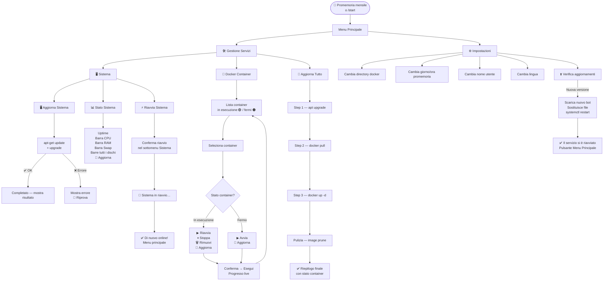

<div align="center">


</div>

[🇬🇧 English](README.md) | 🇮🇹 Italiano

---

# Stack Updater

**Gestisci il tuo server Linux e i container Docker da qualunque posto, direttamente da Telegram.**

---

## Perché l'ho costruito

Gestisco diversi hub casalinghi (Raspberry Pi e ZimaBoard) che eseguono vari container Docker — Home Assistant, Zigbee2MQTT, Matter, WebService, WebServer, strumenti di monitoraggio e altri servizi self-hosted. Ogni volta che dovevo applicare aggiornamenti di sistema o scaricare nuove immagini dei container, dovevo connettermi via SSH alla macchina ed eseguire comandi o script manualmente.

Funziona bene quando sei a casa, ma non è sempre comodo — specialmente quando sei in viaggio e vuoi monitorare o gestire le cose rapidamente. Esistono interfacce web installabili come servizi o container Docker per gestire i sistemi, ma quello di cui avevo bisogno era un modo rapido e semplice per aggiornare il sistema e gestire i container senza saltare tra terminali o interfacce diverse. Senza contare che, quando sei fuori, di solito hai bisogno di una mesh VPN per tunnellare nella tua rete o, ancora meno ideale, esporre servizi su un IP pubblico con porte aperte.

Per questo ho costruito **Stack Updater** — un bot Telegram che gira come servizio systemd sul server e mi permette di aggiornare il sistema e gestire ogni container Docker con pochi tocchi, in sicurezza, da qualunque parte del mondo, senza VPN né port forwarding, con feedback in tempo reale ad ogni passo.

Riguardo alla sicurezza, vale la pena fare una nota chiara e trasparente: l'accesso al sistema è interamente legato al tuo account Telegram. Questo significa che la sicurezza complessiva dipende da quanto bene il tuo dispositivo e il tuo account sono protetti (ad esempio con un codice di accesso o l'autenticazione biometrica). Il bot stesso esegue solo comandi predefiniti e controllati (aggiornamenti di sistema e gestione dei container), quindi non espone funzionalità arbitrarie sul server.

Se mai sospettassi che qualcuno abbia avuto accesso al tuo smartphone o al tuo account Telegram, puoi agire immediatamente in modo molto semplice: revoca il token del bot tramite BotFather su Telegram (con il comando /revoke) e generane uno nuovo. Questo invalida istantaneamente qualsiasi comunicazione precedente e il bot smette di rispondere **finché non viene configurato con il nuovo token**.

In sintesi, il sistema è progettato per essere sia pratico che sicuro nell'uso quotidiano, a condizione che tu mantenga il controllo sull'accesso al tuo account Telegram, che funge effettivamente da chiave dell'intera configurazione.

---

## Cosa fa

- 🖥️ **Aggiornamento sistema** — esegue `apt-get update && apt-get upgrade`, offre il **full-upgrade** se i pacchetti sono trattenuti, e propone `apt-get autoremove` quando vengono trovati pacchetti orfani
- 📊 **Stato sistema** — mostra in tempo reale uptime, CPU, RAM e ogni disco montato con barre di avanzamento Unicode (`█░`)
- 🐳 **Gestione container** — elenca tutti i container (in esecuzione e fermi), permette di avviare, riavviare, fermare, rimuovere o aggiornare qualsiasi container singolarmente
- 🔄 **Aggiornamento completo** — sistema + tutti i container in un'unica operazione, con pulizia automatica delle immagini (`docker image prune`)
- ⚡ **Riavvio remoto** — riavvia il server e ti notifica quando torna online
- 📅 **Promemoria mensile** — invia un messaggio Telegram programmato nel giorno e all'ora che scegli, chiedendo se vuoi aggiornare
- ⚙️ **Pannello impostazioni** — cambia la directory Docker, la pianificazione del promemoria, il nome utente, la lingua o controlla gli aggiornamenti del bot — tutto da Telegram
- ⬆️ **Auto-aggiornamento** — il bot può scaricare e installare una nuova versione di sé stesso, riavviare il servizio e confermare il risultato editando l'ultimo messaggio
- 🌐 **Bilingue** — supporto completo italiano e inglese, cambiabile in qualsiasi momento dalle impostazioni

---

## Prerequisiti

Prima di installare, assicurati che il tuo sistema abbia:

| Requisito | Note |
|---|---|
| Debian / Raspberry Pi OS (o derivati) | Funziona anche con Ubuntu, Armbian ecc. |
| Python 3.9 o superiore | Di solito pre-installato |
| Docker Engine | [Guida all'installazione](https://docs.docker.com/engine/install/) |
| Plugin `docker compose` v2 | `apt-get install docker-compose-plugin` |
| systemd | Necessario per eseguire il bot come servizio in background |
| curl | Di solito pre-installato |
| Accesso root | L'installer deve girare come root |

---

## Passo 1 — Crea il tuo Bot Telegram

Prima di eseguire l'installer hai bisogno di un token per il Bot Telegram. Ecco come ottenerlo:

1. Apri Telegram e cerca **[@BotFather](https://t.me/BotFather)**
2. Avvia una chat e invia il comando `/newbot`
3. BotFather chiederà un **nome** (nome visualizzato, es. `Il Mio Stack Updater`) e poi uno **username** (deve finire con `Bot`, es. `IlMioStackUpdaterBot`)
4. Una volta creato, BotFather risponde con il tuo token in questo formato:

   ```
   123456789:ABCDefGhIJKlmNoPQRsTUVwxyZ
   ```

5. **Copia questo token** — l'installer lo chiederà

> **Tieni il token privato.** Chiunque ce l'abbia può controllare il tuo bot.

Non devi configurare webhook, comandi o altre impostazioni di BotFather — l'installer gestisce tutto.

---

## Passo 2 — Installa Stack Updater

Esegui questo singolo comando sul tuo server (come root o con sudo):

```bash
wget -O install.sh https://raw.githubusercontent.com/dmsmartech/stack-updater/main/install.sh && sudo bash install.sh
```

L'installer è completamente interattivo e ti guida passo dopo passo. Ecco cosa fa:

### Selezione lingua

```
Please select your language / Seleziona la lingua:

  1) English
  2) Italiano

Choice / Scelta [1]:
```

### Verifica prerequisiti

L'installer verifica automaticamente che Python, pip3, Docker, docker compose, systemd e curl siano tutti presenti e soddisfino i requisiti di versione. Se pip3 è mancante lo installa automaticamente.

### Procedura di configurazione

L'installer chiede le seguenti informazioni, un passo alla volta. I valori predefiniti sono mostrati tra `[parentesi]` — premi Invio per accettarli.

| Passo | Cosa chiede | Note |
|---|---|---|
| ① | **Directory di installazione** | Dove collocare i file del bot (default: `/opt/StackUpdater`) |
| ② | **Token del Bot Telegram** | Incolla il token da BotFather — viene verificato immediatamente |
| ③ | **Chat ID Telegram** | Invia un messaggio qualsiasi al tuo bot, poi premi Invio — viene rilevato automaticamente |
| ④ | **Directory Docker Compose** | Scansionata automaticamente dai percorsi comuni; scegli dalla lista o inserisci manualmente |
| ⑤ | **Il tuo nome** | Usato nei messaggi di benvenuto del bot |
| ⑥ | **Promemoria mensile** | Giorno del mese (1–28) e ora (HH:MM) per il promemoria programmato |
| ⑦ | **Riepilogo e conferma** | Rivedi tutto prima che l'installazione inizi |

### Cosa viene installato

```
/opt/StackUpdater/
├── stack_updater.py          ← punto di ingresso (avvia il bot)
├── stack_updater_config.json ← la tua configurazione (token, chat ID, percorsi…)
├── VERSION                   ← versione installata
├── states.py                 ← costanti degli stati della conversazione
├── config.py                 ← loader e accessor della configurazione
├── utils.py                  ← utility principali (run_cmd, tastiere, messaggi live)
├── lang.py                   ← motore lingua (t(), switch_lang())
├── version.py                ← verifica versione e rilevamento aggiornamenti
├── ui.py                     ← helper UI condivisi (costruttore menu principale)
├── handlers/                 ← livello interazione Telegram
│   ├── shared.py             ← helper schermata condivisi (menu, lista container)
│   ├── start.py              ← /start e tasto Menu
│   ├── menu.py               ← navigazione menu principale e aggiornamenti
│   ├── system.py             ← flusso aggiornamento sistema, stato e riavvio
│   ├── docker.py             ← flusso gestione container Docker
│   ├── all_updates.py        ← flusso aggiornamento completo (sistema + container)
│   ├── settings.py           ← pannello impostazioni
│   └── jobs.py               ← lavori pianificati (promemoria mensile)
├── operations/               ← livello logica applicativa
│   ├── core.py               ← helper operazioni apt/docker condivisi
│   ├── system_ops.py         ← wrapper apt update/upgrade/autoremove
│   ├── docker_ops.py         ← wrapper azioni docker compose
│   ├── all_ops.py            ← orchestrazione aggiornamento completo
│   └── app_update.py         ← logica auto-aggiornamento del bot
├── helpers/                  ← livello accesso dati
│   ├── system.py             ← dati apt + monitoraggio CPU/RAM/disco
│   └── docker.py             ← dati docker (container, inspect, ID immagini)
└── languages/
    ├── it.json               ← stringhe italiano
    └── en.json               ← stringhe inglese

/etc/systemd/system/stack_updater.service   ← servizio systemd
/var/log/stack_updater.log                  ← file di log
```

> La directory di installazione sopra è il layout **runtime** — tutti i file vengono estratti dalla cartella `src/` di questo repository.

Il servizio viene abilitato e avviato automaticamente. Al termine dell'installazione il bot ti invia un messaggio di conferma su Telegram.

---

## Come funziona



---

## Navigazione nel bot

Dopo l'installazione, apri il tuo bot su Telegram e invia `/start` (o tocca **📋 Menu**). Vedrai il menu principale:

```
😊 Ciao Dario!

Sono qui per aiutarti a gestire il tuo server.
Cosa facciamo oggi?

[ 🛠️ Gestione Servizi ]
[ ⚙️ Impostazioni     ]
```

### Gestione Servizi

```
🛠️ Gestione Servizi

Da qui puoi aggiornare il sistema operativo, gestire i container Docker
oppure fare tutto in una volta sola.

[ 🖥️ Sistema           ]
[ 🐳 Docker Container  ]
[ 🔄 Aggiorna Tutto    ]
[ ← Menu Principale    ]
```

**Sistema** — apre un sottomenu:

```
🖥️ Sistema

Qui puoi aggiornare i pacchetti di sistema, controllare le risorse hardware
(CPU, RAM e dischi) oppure riavviare la macchina quando necessario.

[ 🖥️ Aggiorna Sistema  ]
[ 📊 Stato Sistema     ]
[ ⚡ Riavvia Sistema   ]
[ ← Torna Indietro     ]
```

- **Aggiorna Sistema** — mostra il numero di pacchetti aggiornabili, chiede conferma, poi esegue `apt-get update && apt-get upgrade -y` con output live. Se alcuni pacchetti sono trattenuti dall'upgrade standard, compare un pulsante **Full Upgrade**. A completamento, se vengono trovati pacchetti orfani, viene proposto un prompt per eseguire `apt-get autoremove`.
- **Stato Sistema** — legge live `/proc/uptime`, `/proc/stat`, `free` e `df`, poi mostra uptime, CPU, RAM, swap (se configurata) e tutti i filesystem `/dev/*` montati come barre di avanzamento Unicode, con un pulsante **🔄 Aggiorna** per ricaricare i dati in-place:

  ```
  📊 Stato Sistema

  ⏱ Attivo da: 3 giorni, 4:12:05
  ──────────────────────

  🖥️ CPU
  ████████░░░░░░░░░░░░  38%

  🧠 RAM
  ██████████████░░░░░░  71%   1.4 GB / 2.0 GB

  💿 Swap
  ██░░░░░░░░░░░░░░░░░░  8%    200 MB / 2.0 GB

  💾 /
  ████████████░░░░░░░░  58%   14.2 GB / 29.0 GB

  💾 /mnt/data
  ██████░░░░░░░░░░░░░░  29%   87.3 GB / 290.0 GB
  ```

**Docker Container** — elenca ogni container trovato nel tuo `docker-compose.yml`:

```
🐳 Docker Container

Seleziona un container per gestirlo singolarmente,
oppure aggiornali tutti in una sola operazione.

🟢 homeassistant
🟢 mosquitto
🟠 portainer
[ 🔄 Aggiorna tutti i container ]
[ ← Torna Indietro ]
```

Un pallino verde 🟢 significa che il container è in esecuzione; uno arancione 🟠 che è fermo. Tocca qualsiasi container per gestirlo singolarmente.

**Aggiorna Tutto** — esegue tutti e tre i passi in sequenza (sistema → pull → up) con una vista numerata del progresso, poi elimina le immagini inutilizzate e mostra un riepilogo finale di tutti i container attivi.

**Riavvia Sistema** — disponibile nel sottomenu **Sistema**. Chiede conferma, riavvia il server e invia un messaggio _"✅ Sistema riavviato con successo!"_ non appena il bot torna online.

### Dettaglio container

Toccando un container si apre la schermata di dettaglio, con pulsanti diversi in base al suo stato:

| Stato | Azioni disponibili |
|---|---|
| 🟢 In esecuzione | 🔁 Riavvia · ⏸ Stoppa · 🗑 Rimuovi · 🔄 Aggiorna |
| 🟠 Fermo | ▶ Avvia · 🔄 Aggiorna |

Ogni azione chiede conferma prima di essere eseguita e mostra un messaggio di progresso live. Al completamento, toccare **← Torna Indietro** invia una lista container aggiornata.

### Impostazioni

```
⚙️ Impostazioni

[ 📁 Directory Docker Compose ]
[ 📅 Giorno promemoria        ]
[ 🕐 Ora promemoria           ]
[ 👤 Username                 ]
[ 🌐 Cambia lingua            ]
[ 🆕 Aggiornamenti            ]
[ ← Menu Principale           ]
```

La schermata **Ora promemoria** mostra anche l'orologio di sistema del server e il fuso orario, così puoi impostare l'orario corretto senza dover calcolare l'offset.

Il pulsante **Aggiornamenti** forza una verifica immediata della versione e, se è disponibile una nuova versione, ti permette di aggiornare il bot con un tocco.

### Flusso di auto-aggiornamento

Quando è disponibile una nuova versione di Stack Updater (verificata automaticamente ad ogni `/start`, con cache di 24 ore):

1. Ricevi una notifica con la versione attuale e quella nuova
2. Tocca **⬆️ Aggiorna ora** — il bot scarica i nuovi file e si sostituisce
3. Il messaggio di progresso mostra _"Il servizio si riavvierà tra pochi secondi…"_
4. Il servizio si riavvia tramite `systemctl`
5. All'avvio, lo stesso messaggio viene **editato** per mostrare _"✅ Il servizio si è riavviato"_ con un pulsante **Menu Principale**

---

## Lingue supportate

| Codice | Lingua | Stato |
|---|---|---|
| `it` | 🇮🇹 Italiano | ✅ Integrato |
| `en` | 🇬🇧 English | ✅ Integrato |

La lingua viene selezionata durante l'installazione e può essere cambiata in qualsiasi momento da **Impostazioni → Cambia lingua**. Tutti i messaggi del bot si aggiornano immediatamente.

### Aggiungere una nuova lingua

I file lingua sono semplici JSON nella cartella `languages/`. Per aggiungere una nuova lingua:

1. Copia `languages/it.json` e rinominalo con il tuo codice lingua
2. Traduci tutti i valori delle stringhe — **non cambiare le chiavi**
3. Aggiorna i campi di metadati in cima:
4. Apri una pull request — i contributi sono benvenuti

---

## Comandi utili

```bash
# Verifica stato del servizio
sudo systemctl status stack_updater

# Stream log in tempo reale
sudo journalctl -u stack_updater -f

# Riavvia il servizio
sudo systemctl restart stack_updater

# Ferma il servizio
sudo systemctl stop stack_updater

# Disabilita l'avvio automatico
sudo systemctl disable --now stack_updater
```

### Aggiornamento tramite installer

Se preferisci aggiornare dal server invece che da Telegram:

```bash
wget -O install.sh https://raw.githubusercontent.com/dmsmartech/stack-updater/main/install.sh && sudo bash install.sh
```

L'installer rileva l'installazione esistente e offre tre opzioni: **Aggiorna**, **Disinstalla** o **Annulla**.

### Disinstallazione

Esegui l'installer e scegli **Disinstalla**, oppure manualmente:

```bash
sudo systemctl disable --now stack_updater
sudo rm -rf /opt/StackUpdater
sudo rm /etc/systemd/system/stack_updater.service /var/log/stack_updater.log
sudo systemctl daemon-reload
```

---

## Struttura del repository

```
stack-updater/
├── install.sh                ← installer / updater / uninstaller
├── VERSION                   ← versione attuale
├── ARCHITECTURE.md           ← guida sviluppatore e riferimento SDK
├── README.md                 ← versione inglese
├── README_IT.md              ← questo file (Italiano)
├── LICENSE
└── src/                      ← tutti i file sorgente del bot (installati flat in INSTALL_DIR)
    ├── stack_updater.py      ← punto di ingresso
    ├── states.py             ← stati della conversazione
    ├── config.py             ← gestione configurazione
    ├── utils.py              ← utility principali
    ├── lang.py               ← motore lingua
    ├── version.py            ← verifica versione
    ├── ui.py                 ← helper UI condivisi
    ├── handlers/             ← livello interazione Telegram
    │   ├── system.py         ← aggiornamento sistema, stato e riavvio
    │   ├── docker.py         ← gestione container
    │   └── …
    ├── operations/           ← livello logica applicativa
    │   ├── docker_ops.py     ← wrapper docker compose
    │   └── …
    ├── helpers/              ← livello accesso dati
    │   ├── system.py         ← dati apt + monitoraggio CPU/RAM/disco
    │   └── docker.py         ← dati docker
    └── languages/
        ├── it.json           ← stringhe italiano
        └── en.json           ← stringhe inglese
```

> Per una descrizione dettagliata di ogni modulo e una guida passo-passo per aggiungere nuove funzionalità, vedi [ARCHITECTURE.md](ARCHITECTURE.md).

---

## Licenza

MIT — vedi [LICENSE](LICENSE)

---

<div align="center">
  <sub>Creato da <a href="https://github.com/dmsmartech">dm.smartech</a> — Dario Montalbano</sub>
</div>
